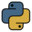

# Python Cheat 

Python information and cheatsheets.

Stdlib and third party libraries are covered.

1.  Featured
    1. [main.py](main.py): major cheat
1.  Introduction
    1. [Getting started](getting-started.md)
    1. [Implementations](implementations.md)
    1. [python utility](python-utility.md)
    1. [Style guides](style-guides.md)
    1. [Pros and cons](pros-and-cons.md)
    1. [How to hack Python projects](how-to-hack-python-projects.md)
1.  Code
    1. [multifile/main.py](multifile/main.py): `import`, modules, `imp`
    1. [argparse_cheat.py](argparse_cheat.py)
1.  [Bibliography](bibliography.md)
1.  [CONTRIBUTING](CONTRIBUTING.md)
